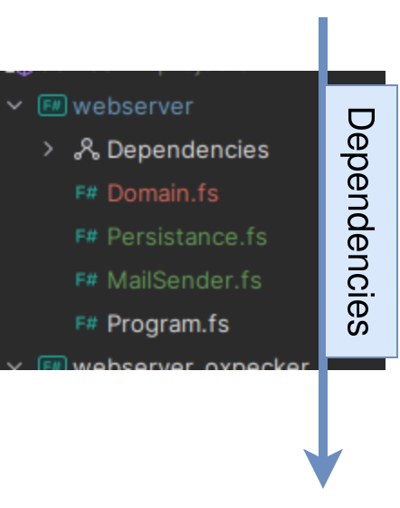

# Welcome to Good Function

and the very first lecture!

<div class="abs-br m-6 text-xl">
  <button @click="$slidev.nav.openInEditor" title="Open in Editor" class="slidev-icon-btn">
    <carbon:edit />
  </button>
</div>

<!--
The last comment block of each slide will be treated as slide notes. It will be visible and editable in Presenter Mode along with the slide. [Read more in the docs](https://sli.dev/guide/syntax.html#notes)
-->

---
transition: slide-up
layout: center
class: text-center

---

<picture>
  <source srcset="https://fonts.gstatic.com/s/e/notoemoji/latest/1f917/512.webp" type="image/webp">
  
</picture>

---
layout: center
transition: fade
---

<picture>
  
</picture>

---
layout: center
---

<picture>
  
</picture>
<!--Przykłady myślenia-->

---
layout: center
---

<picture>
  
</picture>

---
layout: center
---

<picture>
  
</picture>

---

```cs {1|2-18|18-41|31|*}{maxHeight:'450px'}
public class SoCalledDomainService {
        private readonly INotifier _notifier;
        private readonly IMailService _mailService;
        private readonly IRepository _repository;
        private readonly ILogger _logger;

        public SoCalledDomainService(
            INotifier notifier,
            IMailService mailService,
            IRepository repository,
            ILogger logger)
        {
            _notifier = notifier;
            _mailService = mailService;
            _repository = repository;
            _logger = logger;
        }

        public async Task ExecuteDomainLogic()
        {
            try
            {
                _logger.LogInfo("Executing domain logic...");
                var data = _await repository.GetData();
                if (data == null)
                {
                    _logger.LogWarning("No data found.");
                    _notifier.Notify("No data available.");
                    return;
                }
                data.deletedAt = DateTime.Now;
                await _repository.save(data);
                _mailService.SendMail("recipient@example.com", "You were deleted", "Bla bla bla");
                _logger.LogInfo("Mail sent successfully.");
            }
            catch (Exception ex)
            {
                _logger.LogError("An error occurred while executing domain logic.", ex);
                _notifier.Notify("An error occurred. Please check the logs.");
            }
        }
}
```

---
layout: center
---

<picture>
  
</picture>


---
layout: center
---

<picture>
  
</picture>

---
layout: center
---

<picture>
  
</picture>

---
layout: center
---

<picture>
  
</picture>

---
layout: center
---

<picture>
  
</picture>

---
layout: center
---

<picture>
  
</picture>

---
layout: center
---

<picture>
  
</picture>

---
layout: center
transition: fade
---

# Cards
```fsharp {1|3-4|6|7-8|9-10|12-13}
type Suit = | Spades | Clubs | Diamonds | Hearts
  
type Rank = | Two  | Three | Four  | Five  | Six  | Seven | Eight
            | Nine | Ten | Jack | Queen | King
  
type Card = Rank * Suit
type Deck = Card list
type Hand = Card list
type Player = { Name: string; Hand: Hand }
type Game = { Deck: Deck; Players: Player list }

type Deal = Deck -> (Deck * Card)
type PickupCard = (Hand * Card) -> Hand
```

---
layout: center
transition: fade
---

# Cards
```fsharp 
type Suit = | Spades | Clubs | Diamonds | Hearts
  
type Rank = | Two  | Three | Four  | Five  | Six  | Seven | Eight
            | Nine | Ten | Jack | Queen | King
  
type Card = Rank * Suit
type Deck = Card list
type Hand = Card list
type Player = { Name: string; Hand: Hand }
type Game = { Deck: Deck; Players: Player list }

type Deal = Deck -> (Deck * Card)
type PickupCard = (Hand * Card) -> Hand
```

---
layout: center
transition: fade
---

# Cards
```fsharp {4}
type Suit = | Spades | Clubs | Diamonds | Hearts
  
type Rank = | Two  | Three | Four  | Five  | Six  | Seven | Eight
            | Nine | Ten | Jack | Queen | King | Ace
  
type Card = Rank * Suit
type Deck = Card list
type Hand = Card list
type Player = { Name: string; Hand: Hand }
type Game = { Deck: Deck; Players: Player list }

type Deal = Deck -> (Deck * Card)
type PickupCard = (Hand * Card) -> Hand
```
<!--Can non programmers provide feedback?-->

---
layout: center
transition: fade
---

# Cards
```fsharp{12}
type Suit = | Spades | Clubs | Diamonds | Hearts
  
type Rank = | Two  | Three | Four  | Five  | Six  | Seven | Eight
            | Nine | Ten | Jack | Queen | King | Ace
  
type Card = Rank * Suit
type Deck = Card list
type Hand = Card list
type Player = { Name: string; Hand: Hand }
type Game = { Deck: Deck; Players: Player list }

type Deal = Deck -> (Deck * Card)
type PickupCard = (Hand * Card) -> Hand
```
<b color="red">Expert:</b> This is not right, we use shuffled deck to deal!

---
layout: center
transition: fade
---

# Cards
```fsharp{12}
type Suit = | Spades | Clubs | Diamonds | Hearts
  
type Rank = | Two  | Three | Four  | Five  | Six  | Seven | Eight
            | Nine | Ten | Jack | Queen | King | Ace
  
type Card = Rank * Suit
type Deck = Card list
type Hand = Card list
type Player = { Name: string; Hand: Hand }
type Game = { Deck: Deck; Players: Player list }

type Deal = ShuffledDeck -> (ShuffledDeck * Card)
type PickupCard = (Hand * Card) -> Hand
```
<b color="red">Me:</b> Like this?
<br/>
<b color="red">Expert:</b> Yes, just like that.

---
layout: center
transition: fade
---

# Cards
```fsharp{8,13}
type Suit = | Spades | Clubs | Diamonds | Hearts
  
type Rank = | Two  | Three | Four  | Five  | Six  | Seven | Eight
            | Nine | Ten | Jack | Queen | King | Ace
  
type Card = Rank * Suit
type Deck = Card list
type ShuffledDeck = Card list
type Hand = Card list
type Player = { Name: string; Hand: Hand }
type Game = { Deck: Deck; Players: Player list }

type Deal = ShuffledDeck -> (ShuffledDeck * Card)
type PickupCard = (Hand * Card) -> Hand
```
<b color="red">Me:</b> What's shuffled deck?
<br/>
<b color="red">Expert:</b> It's a list of cards.

---
layout: center
transition: fade
---

# Cards
```fsharp{8,13,15}
type Suit = | Spades | Clubs | Diamonds | Hearts
  
type Rank = | Two  | Three | Four  | Five  | Six  | Seven | Eight
            | Nine | Ten | Jack | Queen | King | Ace
  
type Card = Rank * Suit
type Deck = Card list
type ShuffledDeck = Card list
type Hand = Card list
type Player = { Name: string; Hand: Hand }
type Game = { Deck: Deck; Players: Player list }

type Deal = ShuffledDeck -> (ShuffledDeck * Card)
type PickupCard = (Hand * Card) -> Hand
type Shuffle = Deck -> ShuffledDeck
```
<b color="red">Me:</b> How do you make a shuffled deck?
<br/>
<b color="red">Expert:</b> Well... you shuffle them.

---
layout: center
transition: slide-up
---

# Cards final version
```fsharp
type Suit = | Spades | Clubs | Diamonds | Hearts
  
type Rank = | Two  | Three | Four  | Five  | Six  | Seven | Eight
            | Nine | Ten | Jack | Queen | King | Ace
  
type Card = Rank * Suit
type Deck = Card list
type ShuffledDeck = Card list
type Hand = Card list
type Player = { Name: string; Hand: Hand }
type Game = { Deck: Deck; Players: Player list }

type Deal = ShuffledDeck -> (ShuffledDeck * Card)
type PickupCard = (Hand * Card) -> Hand
type Shuffle = Deck -> ShuffledDeck
```
<!-- No database, persistance ignorance, no services, mnagers, interfaces, classes, async await stuff. It's domain driven code. -->

---
transition: slide-up
---

# Algebraic data types are awesome!

<picture>
  <source srcset="https://fonts.gstatic.com/s/e/notoemoji/latest/1f929/512.webp" type="image/webp">
  
</picture>

---
transition: slide-up
layout: center
---

# File ordering




---
transition: slide-up
layout: center
---

# File ordering


---
transition: slide-up
layout: center
---

# Spaces in variables or function names


```cs
[Fact]
public void Given_AlignExpenses_When_BillingItemsHaveReservationIdsThatWereAlreadyBilled_Then_ExpensesAreBeingSent()
```
vs
```fsharp
let ``Given align expenses when billing items have reservationIds that were already billed then expenses are being sent`` = ()
```

---
transition: slide-up
layout: center
---

# Demo on Type providers

---
transition: slide-up
layout: center
---

# Demo on Pattern matching

---
transition: slide-up
layout: center
---

# Demo on Type inference and automatic generatlization

---
transition: slide-up
layout: center
---

# Demo on Structural equality

---
transition: slide-up
layout: center
---

# Demo on Simple web api

---

<Tweet id="1854994763164139923" scale="0.85" />

---
layout: center
---

# Where to learn more?


<div style="display: flex; gap: 10px;">
  
  
</div>

https://exercism.org/tracks/fsharp

https://fsharpforfunandprofit.com/

---

# Questions?

<Toc columns="3"/>
